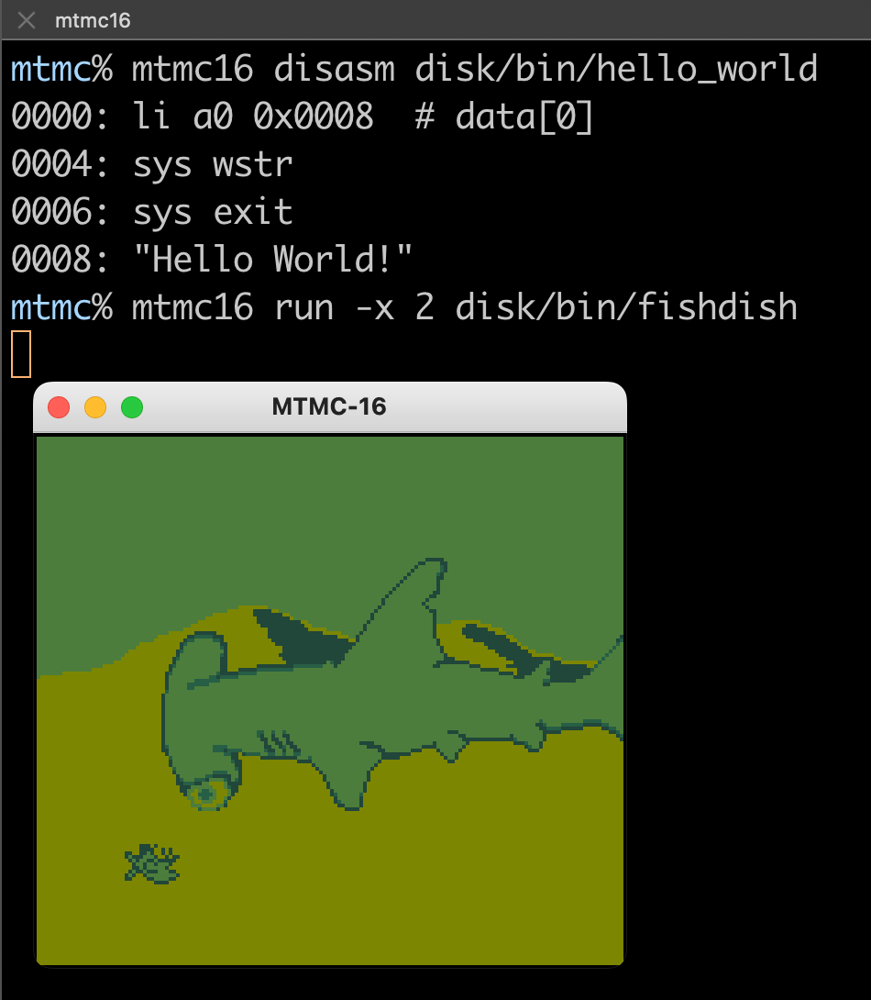

MTMC-16
==
(a port of) MonTana state Mini Computer
https://mtmc.cs.montana.edu/

[](https://ukrainewar.carrd.co/)




Run executables:
```
usage: mtmc16 run [-h] [-s SPEED] [-t TRACE] [-x SCALE] FILE [arg]

positional arguments:
  FILE                  executable binary
  arg                   argument to the executable binary

options:
  -s, --speed SPEED     CPU speed in cycles per second
  -t, --trace TRACE     tracing level
  -x, --scale SCALE     scale window
  -h, --help            show this help

```


Assemble executables:
```
usage: mtmc16 asm [-h] [-o OUT] FILE

positional arguments:
  FILE                  assembly source file
```


Disassemble executables:
```
usage: mtmc16 disasm [-h] [-b] [-o OUT] FILE

positional arguments:
  FILE                  binary file

options:
  -b, --bytes           print code bytes
```


Preprocess images:
```
usage: mtmc16 img [-h] [-o OUT] FILE

Convert image to MTMC-16 4-bit graphics

positional arguments:
  FILE                  image file
```
